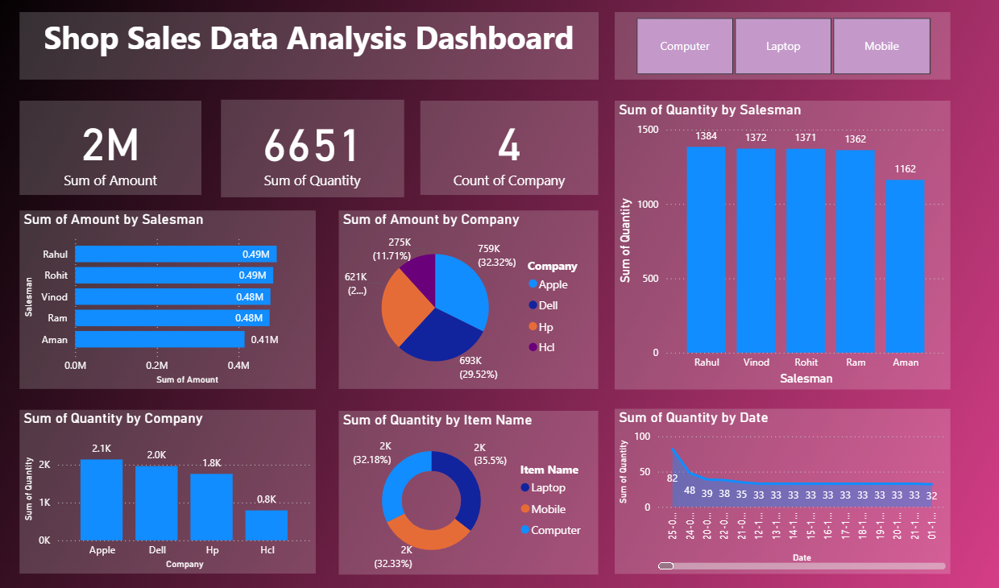

# Shop Sales Dashboard – Power BI
An interactive Power BI dashboard that analyzes shop sales performance based on quantity sold, without using revenue (`Amount`) metrics.

## Features
- Visualizes total quantity sold by item, company, and salesman
- Monthly sales trends using line and column charts
- KPI cards showing total items, unique salesmen, and more
- Interactive slicers for filtering data by date, item, and company
- Clean data model using Power Query and DAX

## Tech Stack
- Power BI Desktop
- DAX & Power Query

## Preview

## Author
Ena Luhadia – [LinkedIn Profile](www.linkedin.com/in/ena-luhadia)

